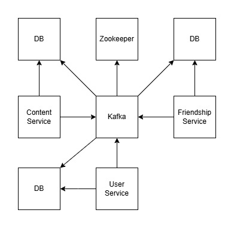

# Deployment
For deploying the system, we fully leveraged Docker.
Initially, it was used as a containerization tool for the various microservices, 
and later as an orchestrator through Docker Compose. This section highlights the key aspects of this process.

## Containerization
A container is a sandbox for running a process and its computational environment.
Containers are created from images, that are composed by layers.
Layers are single, cacheable, steps in the creation of an image.

Each service in the system is containerized, allowing it to be easily instantiated on any machine hosting the Docker engine.

For the databases, Kafka, and Zookeeper, pre-existing images from DockerHub were used, 
while custom images were created for the services we developed.

```dockerfile
FROM openjdk:21-jdk AS build
WORKDIR /Social-Network
COPY ./build/ /Social-Network/
EXPOSE 8080
ENTRYPOINT ["java", "-jar", "./libs/user-service.jar"]
```

The example shows the user-service image. Each line represents a layer:

- **FROM**: Specifies the base image to which subsequent layers are applied.
- **WORKDIR**: Sets the working directory for any RUN, CMD, ENTRYPOINT, COPY, and ADD instructions that follow it in the Dockerfile.
- **COPY**: Copies the compiled code into the working directory.
- **EXPOSE**: Exposes the specified port.
- **ENTRYPOINT**: The command to execute to start the service.

## Health Check
The health check instruction tells Docker how to test a container to check that it's still working.
When a container has a healthcheck specified, it has a health status in addition to its normal status. 
This status is initially `starting`. Whenever a health check passes, it becomes healthy 
(whatever state it was previously in). After a certain number of consecutive failures, it becomes unhealthy.

This mechanism is useful for defining dependencies between containers, 
ensuring that a container waits for another to become healthy before entering the running state.
The dependencies between containers are shown in the following image, where an arrow indicates "depends on".



Although no other services depend on the microservices, we found it useful to introduce a health check for them as well. 
This involves an HTTP REST call to a dedicated endpoint, allowing us to determine when the service is ready to receive requests.
An example of how we utilized the microservices' health check is by running the Docker Compose deployment command 
`docker compose up` with the `--wait` option during testing. 
This ensures that tests are executed synchronously and only after the system has been fully deployed.

## Volumes
Volumes are persistent data stores implemented by the container engine. Compose offers a neutral way for services to mount volumes, 
and configuration parameters to allocate them to infrastructure. 
The top-level volumes declaration lets you configure named volumes that can be reused across multiple services.

Volumes were used specifically for the databases to ensure data persistence 
and to provide an entry point for configuring the tables.
```yaml
services:
  user-sql-db:
    volumes:
    - user-sql-data:/var/lib/mysql
    - ./user-service/init.sql:/docker-entrypoint-initdb.d/init.sql

volumes:
  user-sql-data:
    driver: local
```

## Secrets
Secrets are a flavor of Configs focusing on sensitive data, with specific constraint for this usage.
Services can only access secrets when explicitly granted by a secrets attribute within the services top-level element.
The top-level secrets declaration defines or references sensitive data that is granted to the services in your 
Compose application. The source of the secret is either file or environment.

The secrets mechanism was used to configure the database passwords via files.
```yaml
services:
  user-sql-db:
    environment:
      MYSQL_ROOT_PASSWORD_FILE: /run/secrets/db_root_password
      MYSQL_PASSWORD_FILE: /run/secrets/db_password
    secrets:
      - db_root_password
      - db_password

secrets:
  db_root_password:
    file: db-root-password.txt
  db_password:
    file: db-password.txt
```

## Network
Networks let services communicate with each other. By default, Compose sets up a single network for your app. 
Each container for a service joins the default network and is both reachable by other containers on that network, 
and discoverable by the service's name. 
The top-level networks element lets you configure named networks that can be reused across multiple services.

For this purpose, we used a bridge network, which is the default type.

In terms of networking, a bridge network is a Link Layer device which forwards traffic between network segments. 
A bridge can be a software device running within a host machine's kernel.

```yaml
networks:
  app-network:
    driver: bridge
```

[« Back to Index](../docs.md) | [« Previous](../devops/ci.md) | [Next »](../conclusions/conclusions.md)