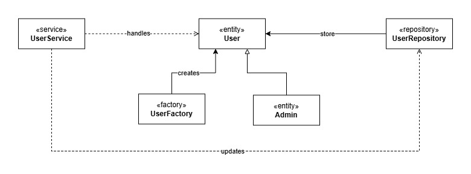
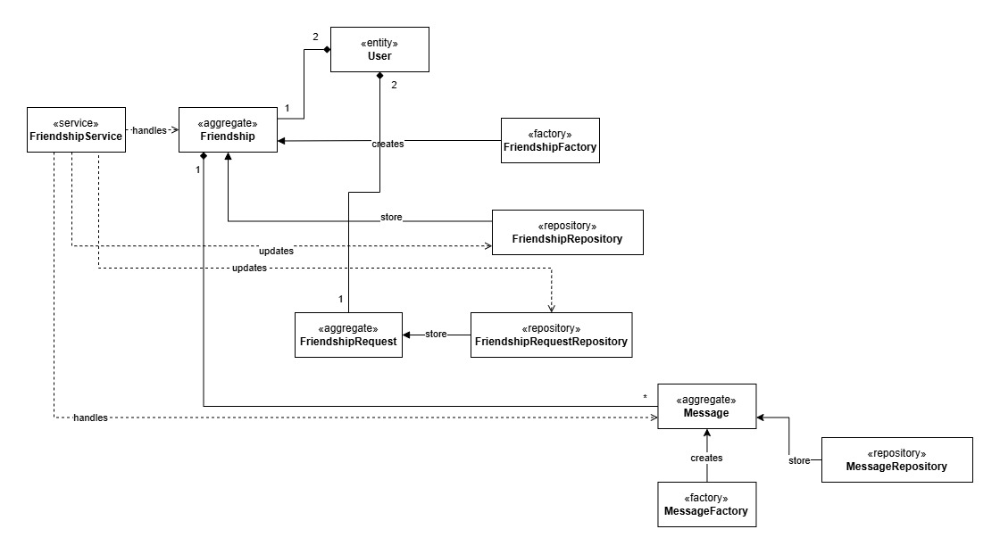
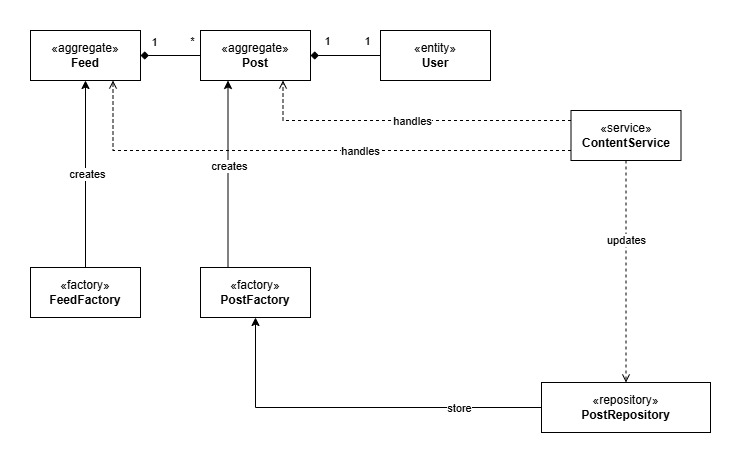

# Bounded Contexts
The system is divided into the following bounded contexts, according to the identified pivotal points:

- **Users** context
- **Friendships** context
- **Contents** context

Following is a detailed description of each bounded context.

## Users
The `Users` bounded context manages everything related to the users, 
authentication and access to app features.

### Events
- `UserCreated`
- `UserUnblocked`
- `UserBlocked`
- `UserUpdated`
- `UserLoggedOut`
- `AdminLoggedOut`
- `UserLoggedIn`
- `AdminLoggedIn`

## Friendships
The `Friendships` bounded context is responsible for managing 
the friendships between users and their messages.

### Events
- `FriendshipRequestSent`
- `FriendshipRequestAccepted`
- `FriendshipRequestRejected`
- `FriendshipRemoved`
- `MessageSent`
- `MessageReceived`

## Contents
The `Contents` bounded context manages everything related to posts.

### Events
- `PostPublished`
- `ContentAlert`