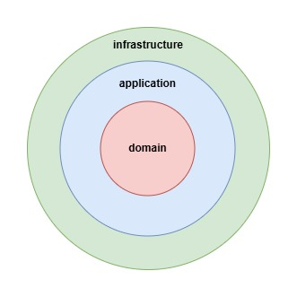

# The Big Picture
Below is a component-and-connector diagram describing the implemented architecture.
This architecture includes three microservices, one for each bounded context identified during the design phase.
The decision to introduce middleware, specifically Kafka, 
stems from the need to achieve eventual consistency within the system through event sourcing. 
Moreover, this solution simplifies the implementation of the notification system,
as the events produced by the services can be consumed by other services or 
hypothetical clients that register a consumer.

From a persistence perspective, each service relies on a database isolated from the rest of the system, 
allowing each service to scale independently of the others.

## Clean Architecture

The various microservices are developed following the principles of clean architecture. In our implementation of the hexagonal architecture, three layers are defined:

- Infrastructure
- Application
- Domain

As per the principles, the outer layers depend on the inner layers, but not vice versa.
As shown in the figure, the outermost layer is Infrastructure, followed by Application, with Domain at the core.

### Domain
This layer contains the entities, the value objects, the domain's aggregate roots, and the factories. For implementation purposes,
the factories are represented by static methods.

### Application
This layer contains the business logic, implemented in DDD services. It is important to note that these services naturally 
depend on repositories. However, to adhere to clean architecture principles, only the repository interfaces 
are included in this layer, effectively abstracting the underlying implementation technologies. 
A similar approach has been applied to event producers, whose interface is also located in this layer.

### Infrastructure
This layer is solely responsible for external communication.
It includes the implementations of repositories and event producers, as well as REST APIs and event consumers.

[« Back to Index](../docs.md) | [« Previous](./ddd.md) | [Next »](./testing.md)